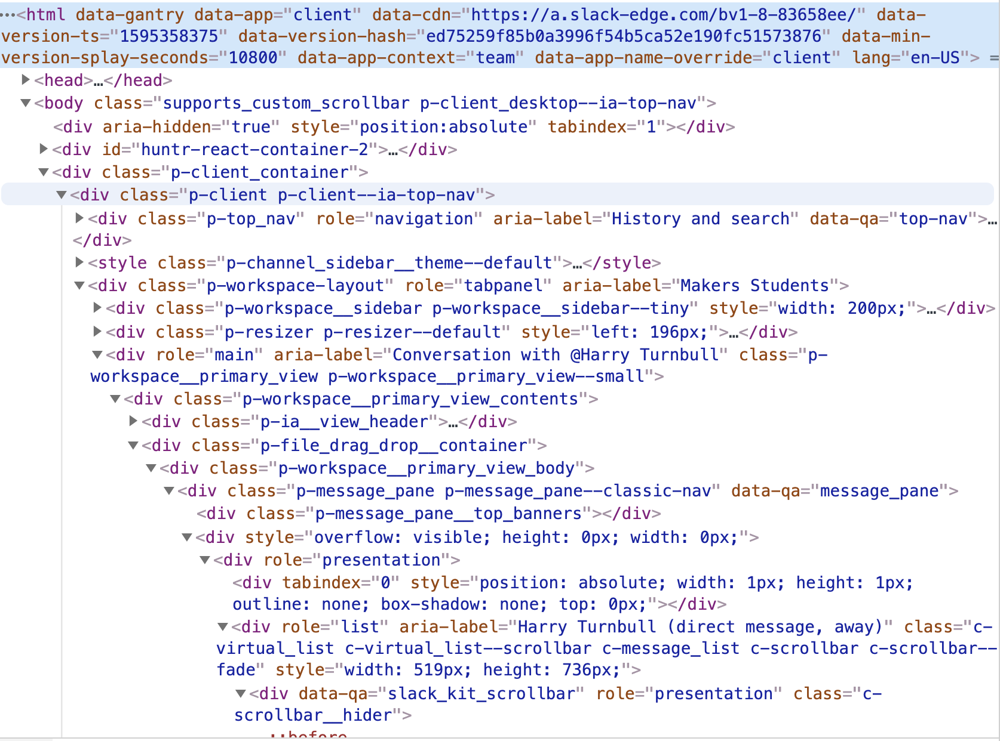
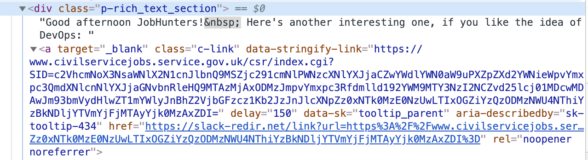
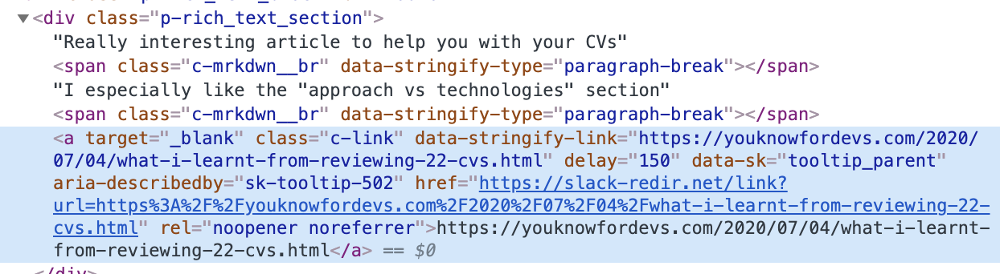
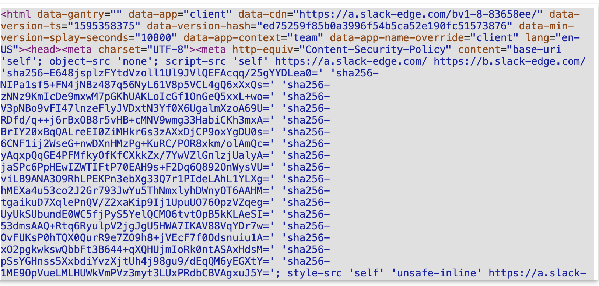

### Problem:

There are great links posted on the Makers slack by peers and tutors slack only gives access to some of the past posts.

One solution is to manually go through the posts and copy and paste them into my notes but this would mean:

- Having to go through all the posts to find the links -
  - this is time consuming
  - I could miss a link,
  - plus there are a lot of links that I do not want (zoom, airtable)
- Manually copying and pasting them
  - time consuming

The aim of this project is to find a more efficient solution

## Language

- Ruby

## How:

1.  Went to the slack website

- Accessed the DevTools on the browser and inspected the elements
  

2.

I analysed what elements the links that I needed where in and noticed that they were always in a **div** with the **class** of **p-rich_text_section **and the links were in an **a** element with a prop of **data-stringify-link**

3. Clicked `Edit as html`

- 

4. Used Regex to find the links and find the text associated with the links which could be used a description

- I used this regex visualising tool to help me plan the regex https://regex101.com/
  `regex = %r{(?<=data-stringify-link=")https:\/\/(?!air)\S[^"]*}`
- In order to get a clean url I needed to use Lookbehinds
  - `(?<=data-stringify-link=")` - Positive Lookbehind to start looking for the string after **data-stringify-link="**
  - `(?!air)`Negative Lookbehind - To not match with strings that included the word **air** so as to ensure airtable links were not included
